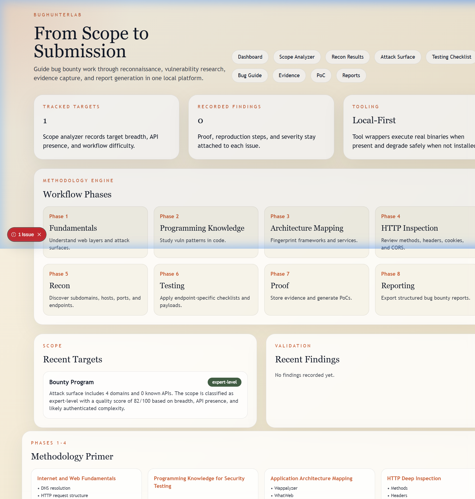
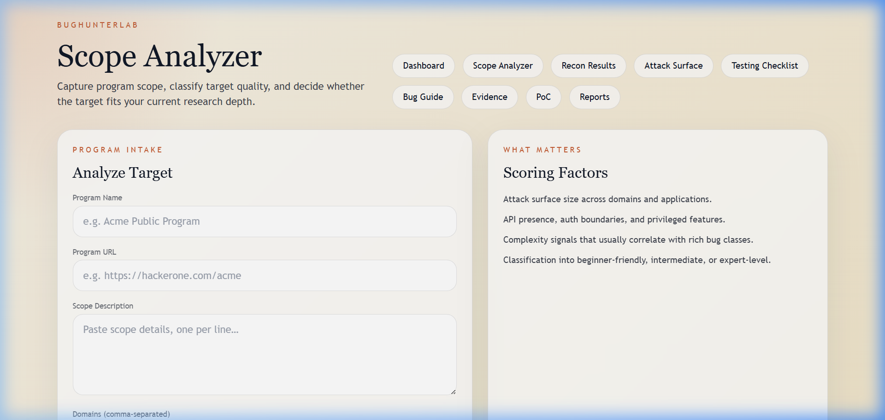
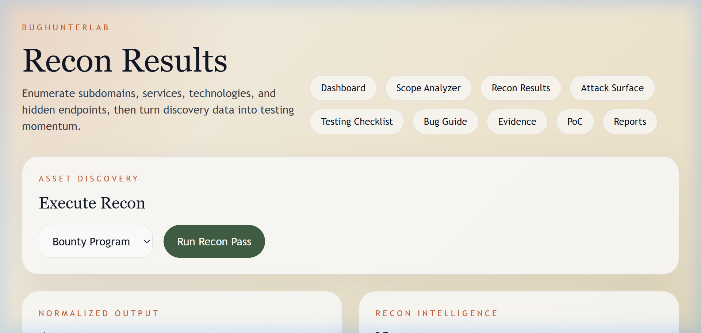
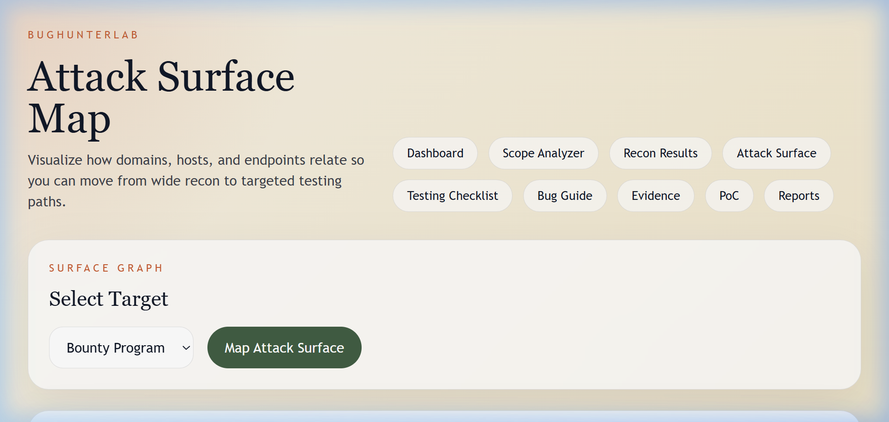
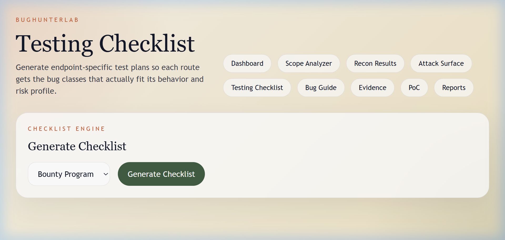
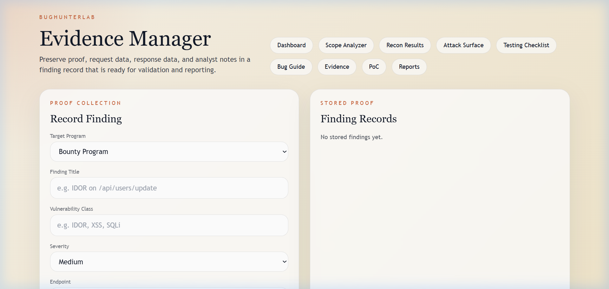
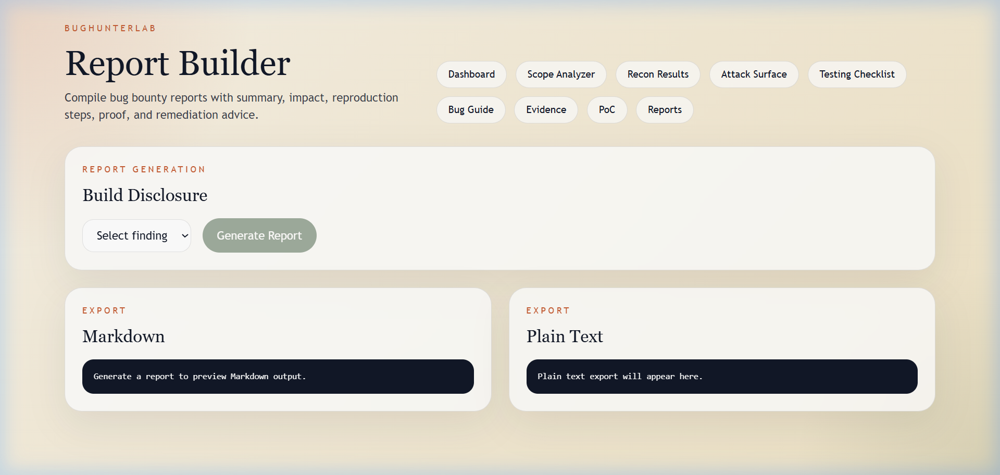

# BugHunterLab

BugHunterLab is a local bug bounty research platform that takes a researcher from target scope to recon, structured testing, proof collection, and report generation.

## What it covers

- Scope analysis with target quality scoring and difficulty classification
- Phase-based workflow aligned to real bug bounty methodology
- Recon orchestration with local wrappers for subfinder, amass, httpx, nmap, ffuf, nuclei, and sqlmap
- Vulnerability intelligence with checklists, impacts, payloads, and language-level insecure code examples
- Endpoint-aware testing checklist generation
- Evidence tracking, PoC generation, and report generation in Markdown, plain text, and PDF
- Local helper scripts for IDOR probing and simple API fuzzing

## Pages

### Dashboard

The main landing page shows tracked targets, recorded findings, workflow phases (1–8), recent scope entries, and a methodology primer.



### Scope Analyzer

Capture program scope, classify target quality, and decide whether the target fits your current research depth. Scoring considers attack surface size, API presence, auth boundaries, and complexity signals.



### Recon Results

Run recon passes against tracked targets. Displays discovered subdomains, live hosts, open ports, technologies, and hidden endpoints.



### Attack Surface Map

Visual overview of the attack surface built from recon data — nodes for domains, hosts, and services with edges showing relationships.



### Testing Checklist

Generate endpoint-specific test plans so each route gets the bug classes that actually fit its behavior and risk profile.



### Evidence Manager

Record findings with vulnerability class, severity, endpoint, reproduction steps, and evidence attachments. All proof stays linked for validation and reporting.



### Report Builder

Export structured bug bounty reports in Markdown, plain text, or PDF. Reports include finding details, reproduction steps, impact, and proof.



## Repository structure

```text
BugHunterLab/
  backend/
  frontend/
  tools/
  database/
  docs/
```

## Backend setup

```bash
cd backend
python -m venv .venv
.venv\Scripts\activate
pip install -r requirements.txt
uvicorn app.main:app --reload --port 8000
```

## Frontend setup

```bash
cd frontend
npm install
npm run dev
```

Open [http://localhost:3000](http://localhost:3000). The frontend expects the backend at [http://localhost:8000](http://localhost:8000).

> **Note:** If you are running Node.js 25+, the dev server includes an `instrumentation.ts` polyfill that patches the non-functional `localStorage` global to prevent SSR crashes in Next.js 15's dev overlay.

## Example workflow

1. Open Scope Analyzer and paste program scope, domains, APIs, and notes.
2. Run a recon pass from Recon Results.
3. Review Attack Surface Map and Testing Checklist.
4. Record a finding in Evidence Manager.
5. Generate a PoC from PoC Generator.
6. Build Markdown or plain text reports in Report Builder, or download the PDF from `/api/report/{finding_id}/pdf`.

## Local tooling notes

- `tools/run_tool.py` will execute a real tool if it exists in PATH.
- If a tool is not installed, the wrapper returns a safe mocked response so the UI remains usable.
- Sample command starters live in `tools/sample_recon_commands.md`.
- Helper scripts live in `tools/idor_scanner.py` and `tools/api_fuzzer.py`.

## Documentation

- `docs/architecture.md`
- `docs/workflow.md`